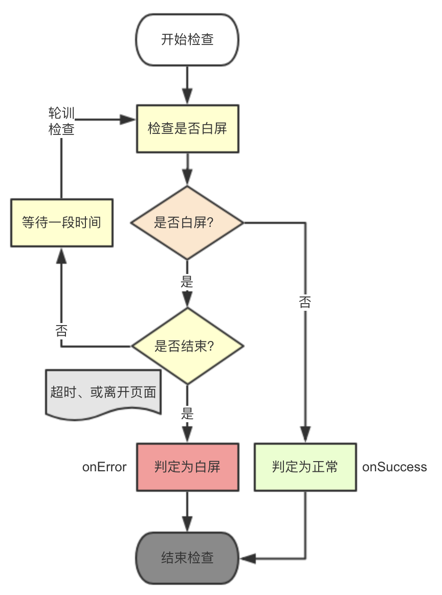

# README

白屏监控组件，支持多实例，默认支持全屏白屏监控，和 React 组件白屏监控。

## USAGE

### 全局白屏监控

blankscreen 内置了全屏白屏监控，引入 blankscreen 后，只需要复写 onError, onSuccess 方法即可。

```js
import BlankScreen from 'blankscreen';

BlankScreen.onError = function(err) {
  console.log('full-page blank screen', err);
};
BlankScreen.onSuccess = function(meta) {
  console.log('full-page OK', meta);
};
```

### React 组件白屏监控

blankscreen 还内置了 React 组件，包含待检查的组件外部即可检查内部是否处于白屏状态。

```jsx
import ReactBlankScreen from 'blankscreen/lib/react';

render() {
  return (
    <ReactBlankScreen
      rule-text={10}
      onError={this.onError}
      onSuccess={this.onSuccess}
      autoStart
    >
      <div></div>
    </ReactBlankScreen>
  );
}
```

如果组件需要异步检查，不设置 autoStart 或设置为 false，然后通过 ref 主动调用 start() 方法启动检查。

```jsx
import ReactBlankScreen from 'blankscreen/lib/react';

componentDidMount() {
  setTimeout(() => {
    this.refs.blankscreen.start();
  }, 1000);
}

render() {
  return (
    <ReactBlankScreen
      ref="blankscreen"
      rule-text={10}
      onError={this.onError}
      onSuccess={this.onSuccess}
    >
      <div></div>
    </ReactBlankScreen>
  );
}
```

### 基础用法

```js
import BaseBlankScreen from 'blankscreen/lib/base';

const bs = new BaseBlankScreen(element, {
  rule: {
    text: 0,
  },
  onError: err => console.error(err),
  onSuccess: meta => console.log(meta),
  autoStart: true,
})
bs.start();
```

## 白屏判定规则


| 文字\元素 | 有 | 无 |
|-----------|----|----|
| 有        | 黑 | 黑 |
| 无        | 白 | 白 |

原则上，只通过是否有指定个数的『文字』来判定是否白屏，
子元素个数多少不作为判定条件，只作为附加信息。

注：

- 黑：判定为不是白屏。
- 白：判定为白屏。

## API

### BlankScreen(element, options)

- {HTMLElement} element 监控的元素，如果是 React 元素，则是其子节点。
- {Object} options 可选的选项配置。
  - {Number} rule-text: 白屏规则：有效文本（剔除无效空白符）最少个数，默认设置是 0。子节点有效文本少于或等于这个值，则认为是白屏。
  - {Function} onError: 最终判定为白屏时，会触发 onError
  - {Function} onSuccess: 页面开始正常渲染时，会触发 onSuccess
  - {Boolean} autoStart: 自动开始检查，默认 false。

### .start()

开始检查白屏，白屏时间从此时开始计算。

### .stop()

停止检查。超时（6s）或离开页面时自动停止检查。

注：终止后会判定是否白屏，得到判定结果后，不可再次启动检查。

### <Function> .onError = err => {}

可复写的白屏处理函数。判定为白屏时会调用 onError 函数。

<Object> err:

- state: 白屏状态。
  - timeout: 超时(6s)后判定为白屏。
  - stop: 离开页面时判定为白屏。
- time: 首屏时间。
- textLength: 白屏时的文字数量。
- elemLength: 白屏时子元素数量。

### <Function> .onSuccess = mata => {}

可复写的非白屏处理函数，最终判定为非白屏，会调用 onSuccess 函数。

<Object> meta:

- state: 页面状态，固化为 "success"。
- time: 首屏时间。

## 白屏检查状态机



<!-- PANGU_DISABLE -->
